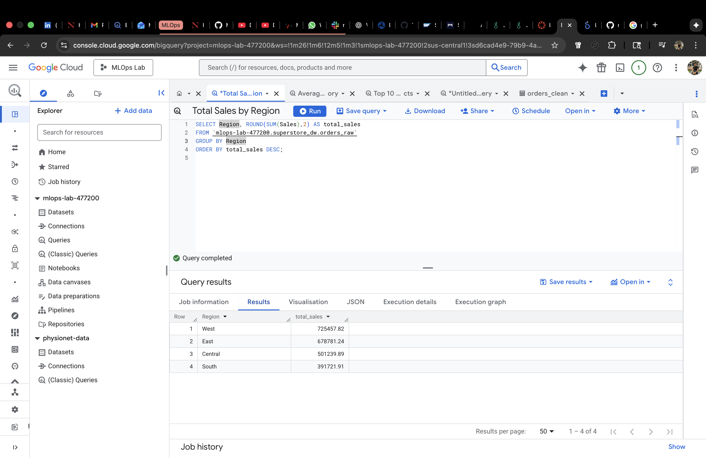

# GCP Superstore Analytics

This MLOps Lab shows a clean retail analytics workflow on Google Cloud:  
CSV → GCS Bucket → BigQuery SQL → Looker Studio dashboards.

Tech used: **GCS, BigQuery, SQL, Looker Studio**

---

## Architecture

| Step | Tool | Action |
|------|------|--------|
| 1 | GCS | Uploaded Superstore Orders CSV file |
| 2 | BigQuery | Loaded raw → cleaned table + ran aggregations |
| 3 | Looker Studio | Built business insights dashboards |

---

## Key Insights Generated

- Total Sales by Region
- Average Profit by Category
- Top 10 Most Profitable Products
- KPI boxes → Total Sales / Total Profit / Total Orders

---

## SQL Queries

queries stored inside `/sql_queries/`

---

## Screenshots

### GCS Bucket – Raw CSV Uploaded

### BigQuery – Tables Created

### Sales by Region

### Final Looker Studio Visualization

---

## Result

This project shows end-to-end analytical skills using Google Cloud — from ingestion → warehouse → business dashboards.
